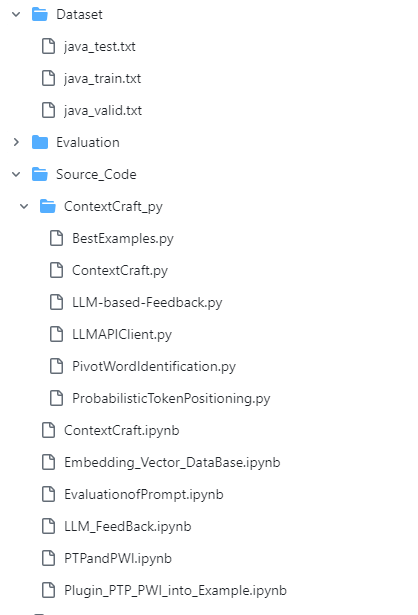
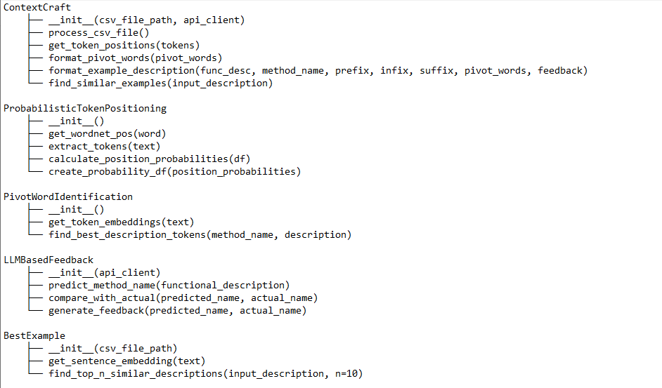

# Replication package for paper : "Automated Generation of Context-Rich Prompts for LLM-based Method Name Suggestion"

# ContextCraft:
ContextCraft is an automated algorithm to generating context-rich prompts for LLMs that generate the expected method names according to the prompts. For a given query (functional description), it retrieves a few best examples whose functional descriptions have
the greatest similarity with the query. From the examples, it identifies tokens that are likely to appear in the final method name as well as their likely positions, picks up pivot words that are semantically related to tokens in the according method names, and specifies
the evaluation results of the LLM on the selected examples. All such outputs (tokens with probabilities and position information, pivot words accompanied by associated name tokens and similarity scores, and evaluation results) together with the query and the selected examples are then filled in a predefined prompt template, resulting in a context-rich prompt..
## Directory Structure

This section provides an overview of the repository structure, including datasets, evaluation results, and source code.

# `Dataset`

This directory contains the dataset files used for training, validation, and testing the models.

- **`java_test.txt`**: Contains functional descriptions and corresponding method names used for testing the model's performance.
- **`java_train.txt`**: Contains functional descriptions and corresponding method names used to train the model.
- **`java_valid.txt`**: Contains functional descriptions and corresponding method names used to validate the model during training.

# `Evaluation`

This directory holds evaluation results and metrics used to assess the performance of the models.

# `Source_Code`

This directory includes various Jupyter notebooks and .py folder of context craft  that implement the core functionalities of the project.
# Class Hierarchy

### ContextCraft

**Purpose:** Orchestrates the use of ProbabilisticTokenPositioning, PivotWordIdentification, LLMBasedFeedback, and BestExample to analyze functional descriptions and method names from a CSV file. Generates formatted example descriptions and finds top similar examples based on semantic similarity.

#### Methods:

- `__init__(csv_file_path, api_client)`: Initializes ContextCraft with the path to the CSV file and the LLM API client. Creates instances of the other classes and reads the CSV into a DataFrame.
- `process_csv_file()`: Processes the CSV file by:
  - Calculating prefix, infix, and suffix probabilities.
  - Identifying pivot words using semantic similarity.
  - Generating feedback using LLM predictions.
  - Formatting and saving the processed descriptions.
- `get_token_positions(tokens)`: Determines the most likely prefix, infix, and suffix for a given set of tokens based on their probabilities.
- `format_pivot_words(pivot_words)`: Formats the pivot words into a readable string.
- `format_example_description(func_desc, method_name, prefix, infix, suffix, pivot_words, feedback)`: Formats the example description to include functional description, method name, context, and feedback.
- `find_similar_examples(input_description)`: Uses BestExample to find the top 10 similar functional descriptions. Processes and formats these descriptions similarly to `process_csv_file()`.

### ProbabilisticTokenPositioning

**Purpose:** Calculates position probabilities for tokens and provides methods for extracting and lemmatizing tokens. Creates a DataFrame of these probabilities for further analysis.

#### Methods:

- `__init__()`: Initializes the lemmatizer, inflect engine, and data structures for counting token positions and occurrences.
- `get_wordnet_pos(word)`: Maps POS tags to the format accepted by the lemmatizer.
- `extract_tokens(text)`: Extracts and lemmatizes tokens from the input text.
- `calculate_position_probabilities(df)`: Calculates the probabilities of tokens appearing as prefix, infix, or suffix in method names.
- `create_probability_df(position_probabilities)`: Converts the position probabilities into a DataFrame for easy access and manipulation.

### PivotWordIdentification

**Purpose:** Uses BERT to find the best matching description token for method name tokens based on semantic similarity. Generates embeddings for comparison.

#### Methods:

- `__init__()`: Initializes the BERT tokenizer and model.
- `get_token_embeddings(text)`: Generates BERT embeddings for each token in the input text.
- `find_best_description_tokens(method_name, description)`: Finds the best matching description token for each method name token by comparing embeddings using cosine similarity.

### LLMBasedFeedback

**Purpose:** Predicts method names using an LLM API and compares them with actual method names using the edit distance formula. Generates feedback statements based on this comparison.

#### Methods:

- `__init__(api_client)`: Initializes LLMBasedFeedback with the LLM API client.
- `predict_method_name(functional_description)`: Uses the LLM API to predict method names from functional descriptions.
- `compare_with_actual(predicted_name, actual_name)`: Compares predicted method names with actual names using edit distance to determine similarity.
- `generate_feedback(predicted_name, actual_name)`: Generates a feedback statement comparing the predicted and actual method names, including the edit distance score.

### BestExample

**Purpose:** Finds the top 10 semantically similar functional descriptions from a CSV file by comparing each description to a given input description using a BERT-based model.

#### Methods:

- `__init__(csv_file_path)`: Initializes BestExample with the path to the CSV file and reads it into a DataFrame.
- `get_sentence_embedding(text)`: Generates a sentence-level embedding for the input text using BERT.
- `find_top_n_similar_descriptions(input_description, n=10)`: Finds the top n semantically similar functional descriptions by computing the cosine similarity between the input description and descriptions in the CSV file. Returns the most similar descriptions with their method names.

### Implementation Workflow

#### Initialization:

1. ContextCraft initializes instances of ProbabilisticTokenPositioning, PivotWordIdentification, LLMBasedFeedback, and BestExample.
2. Reads the CSV file into a DataFrame for processing.

#### CSV File Processing:

1. ContextCraft uses ProbabilisticTokenPositioning to calculate probabilities for prefix, infix, and suffix.
2. Uses PivotWordIdentification to find semantic pivot words based on BERT embeddings.
3. Uses LLMBasedFeedback to predict method names and generate feedback.
4. Formats and saves processed data with examples.

#### Finding Similar Examples:

1. ContextCraft uses BestExample to find top 10 similar functional descriptions for a given input.
2. Processes these descriptions similarly and formats them with context and feedback.

This hierarchy and description provide a detailed overview of the roles and responsibilities of each class, their methods, and how they interact within the ContextCraft framework to process and analyze functional descriptions and method names.

!pip install -r requirements.txt

This snippet gives a clear, step-by-step guide for users to replicate the study, ensuring they understand how to set up their environment correctly. Make sure to include any additional specific instructions or prerequisites needed directly in your README or linked documentation to assist users further.
git clone https://github.com/contextcraft/contextcraft.git

