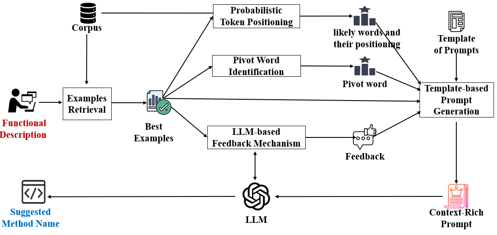

# Replication package for paper : "Automated Generation of Context-Rich Prompts for LLM-based Method Name Suggestion"

# ContextCraft:
ContextCraft is an automated algorithm to generating context-rich prompts for LLMs that generate the expected method names according to the prompts. For a given query (functional description), it retrieves a few best examples whose functional descriptions have
the greatest similarity with the query. From the examples, it identifies tokens that are likely to appear in the final method name as well as their likely positions, picks up pivot words that are semantically related to tokens in the according method names, and specifies
the evaluation results of the LLM on the selected examples. All such outputs (tokens with probabilities and position information, pivot words accompanied by associated name tokens and similarity scores, and evaluation results) together with the query and the selected examples are then filled in a predefined prompt template, resulting in a context-rich prompt..
# Datasets:
Following dataset is used to evalatute the approach
- [English Dataset:](https://github.com/propaki/Automethod/tree/main/EnglishDataset) Method Names with English Functional Descriptions (Dataset of Baseline).

# Approach 

#  [ Probabilistic Token Positioning:](https://github.com/propaki/Automethod/tree/main/OptiPrompts) 
Included in the "[OptiPrompts](https://github.com/propaki/Automethod/tree/main/OptiPrompts)" folder is a carefully curated corpus of prompts, comprised of text files, designed to enhance the performance of ChatGPT in accurately generating Java method names based on functional descriptions. These prompts are crafted to elicit precise and contextually relevant responses from the model, adhering to a well-designed template that aligns with the naming conventions and requirements specific to Java methods.

# [Pivot Word Identification](https://github.com/propaki/Automethod/tree/main/SFT-Training-Corpus):
The [Chinese-SFT-Training-Corpus.JSONL](https://github.com/propaki/Automethod/tree/main/SFT-Training-Corpus/Chinese-SFT-Training-Corpus.JSON) and [English-SFT-Training-Corpus.JSONL](https://github.com/propaki/Automethod/tree/main/SFT-Training-Corpus/English-SFT-Training-Corpus.JSON)  files in the "[SFT-Training-Corpus](https://github.com/propaki/Automethod/tree/main/SFT-Training-Corpus)" folder are specifically tailored for fine-tuning the Large Language Model (LLM) to enhance its capability in generating method names from functional descriptions in Chinese and English. It contains a collection of high-quality conversation samples between two individuals. Each sample comprises a pair: a functional description and the corresponding method name, meticulously extracted through the Best-Example process. This corpus aims to improve the model's accuracy and fluency in handling Chinese language inputs, ensuring the generation of contextually appropriate and conventionally accurate method names.

# [LLM-based Feedback Mechanism:](https://github.com/propaki/Automethod/tree/main/Source-Code/RNN-Attn-Copy.ipynb)
We meticulously reproduced and implemented the baseline model in "[Source-Code](https://github.com/propaki/Automethod/tree/main/Source-Code)", which is a [RNN-Attn-Copy](https://github.com/propaki/Automethod/tree/main/Source-Code/RNN-Attn-Copy.ipynb) equipped with both attention and copying mechanisms. This advanced architecture was chosen as our benchmark for assessing the performance of alternative models due to its proven prowess in sequence-to-sequence translation tasks and its exceptional ability to grasp contextual nuances within sequences.
# mNamer Approach: Semantic-Driven Preprocessing and Fine-Tuning:
The mNamer methodology is structured around two core components:
Semantic-Driven Preprocessing and Fine-Tuning, designed to optimize the process of generating accurate Java method names from functional descriptions.
## 1) Semantic-Driven Preprocessing:
This phase begins with the selection of the best examples of functional descriptions and method names from our dataset. Utilizing the Python script **[SelectBestExamples.ipynb](https://github.com/propaki/Automethod/blob/main/Source-Code/SelectBestExamples.ipynb)** found in the Source-Code folder, we identify the top 1,800 examples. These are then divided into four subsets as follows:

- 300 samples for **[Fine_Tuning.csv](https://github.com/propaki/Automethod/blob/main/English_Best_Examples/Fine_Tuning.csv)**
- 500 for **[Best_Shots.csv](https://github.com/propaki/Automethod/blob/main/English_Best_Examples/Best_Shots.csv)**
- 500 for **[Prompt_Evaluation.csv](https://github.com/propaki/Automethod/blob/main/English_Best_Examples/Prompt_Evaluation.csv)**
- 500 for **[ReinforcementLearning.csv](https://github.com/propaki/Automethod/blob/main/English_Best_Examples/ReinforcementLearning.csv)**

The 500 Best-Shots are converted into vectors using the BERT model through **[EmbeddingBestExamples.ipynb](https://github.com/propaki/Automethod/blob/main/Source-Code/EmbeddingBestExamples.ipynb)**, to calculate semantic similarity. These vectors are stored in the **[English_Embedded](https://github.com/propaki/Automethod/tree/main/English_Best_Examples/English_Embedded)** folder.

Using **[Prompt_Evaluation.csv](https://github.com/propaki/Automethod/blob/main/English_Best_Examples/Prompt_Evaluation.csv)**, we assess the prompt corpus in the **[OptiPrompt](https://github.com/propaki/Automethod/tree/main/OptiPrompts)** folder. To select 30 relevant shots for a given functional description, **[SelectBestShots.ipynb](https://github.com/propaki/Automethod/blob/main/Source-Code/SelectBestShots.ipynb)** compares semantic similarity with the vectors in the **[English-Embedded](https://github.com/propaki/Automethod/tree/main/English_Best_Examples/English_Embedded)** folder, extracting the top 30 relevant examples. This process ensures the creation of an optimal prompt containing best shots that are semantically relevant to the input functional description.
## 2) Fine-Tuning
The fine-tuning stage is divided into two key parts: Supervised Fine Tuning (SFT) and Reinforcement Learning from Human Feedback (RLHF).

### 2A) Supervised Fine Tuning (SFT): 
Using **English-SFT-Training-Corpus.JSONL**, which contains 300 **[Fine_Tuning.csv](https://github.com/propaki/Automethod/blob/main/English_Best_Examples/Fine_Tuning.csv)** samples in a conversational style, we fine-tune the LLMs (e.g., [GPT-3.5-turbo](https://openai.com/blog/gpt-3-5-turbo-fine-tuning-and-api-updates)) with **[Fine-Tuning(SFT+RLHF).ipynb](https://github.com/propaki/Automethod/blob/main/Source-Code/Fine-Tuning(SFT+RLHF).ipynb)**.
### 2 B) Customized RLHF:
We evaluate the semantic similarity between generated method names and the actual method names provided in **[ReinforcementLearning.csv](https://github.com/propaki/Automethod/blob/main/English_Best_Examples/ReinforcementLearning.csv)**, corresponding to the given functional descriptions. Feedback is then given to the SFT-tuned LLM through prompts to further refine its output.
Through this meticulous approach, mNamer aims to enhance the LLM's ability to generate method names that are not only accurate but also semantically aligned with the developers' intentions, thereby improving code readability and maintainability.

# mNamer

This snippet gives a clear, step-by-step guide for users to replicate the study, ensuring they understand how to set up their environment correctly. Make sure to include any additional specific instructions or prerequisites needed directly in your README or linked documentation to assist users further.
git clone https://github.com/propaki/Automethod.git

fine-tuned ready to chat ChatGPT extention availabe at [Mnamer](https://chat.openai.com/g/g-T58v7ELEM-mnamer)
The source code is the centerpiece of this repository, showcasing the application of BERT-based semantic model for both Semantic Driven Preprocessing and BERT-based RLHF in Postprocessing for LLMs to improve its method naming capabilities. This model represents a significant advancement in the field of automated method naming.

Getting Started
To get started with mNamer:
Install the required dependencies: pip install -r requirements.txt
Follow the instructions in the usage_instructions.md file for detailed steps on how to train and evaluate the models using the provided datasets and prompts.
Contribution
Contributions to LLM-MethodNamer are welcome. If you have suggestions for improvement or want to report bugs, please open an issue or submit a pull request.

