# Replication package for paper : "Automated Generation of Context-Rich Prompts for LLM-based Method Name Suggestion"

# ContextCraft:
ContextCraft is an automated algorithm to generating context-rich prompts for LLMs that generate the expected method names according to the prompts. For a given query (functional description), it retrieves a few best examples whose functional descriptions have
the greatest similarity with the query. From the examples, it identifies tokens that are likely to appear in the final method name as well as their likely positions, picks up pivot words that are semantically related to tokens in the according method names, and specifies
the evaluation results of the LLM on the selected examples. All such outputs (tokens with probabilities and position information, pivot words accompanied by associated name tokens and similarity scores, and evaluation results) together with the query and the selected examples are then filled in a predefined prompt template, resulting in a context-rich prompt..
## Directory Structure

This section provides an overview of the repository structure, including datasets, evaluation results, and source code.
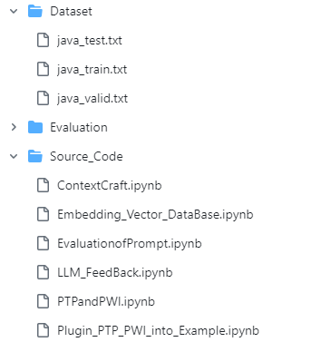

### `Dataset`

This directory contains the dataset files used for training, validation, and testing the models.

- **`java_test.txt`**: Contains functional descriptions and corresponding method names used for testing the model's performance.
- **`java_train.txt`**: Contains functional descriptions and corresponding method names used to train the model.
- **`java_valid.txt`**: Contains functional descriptions and corresponding method names used to validate the model during training.

### `Evaluation`

This directory holds evaluation results and metrics used to assess the performance of the models.

- **`Evaluation/Table 3-4.PNG`**: An image showing tables used for evaluating model performance over description lengths.

### `Source_Code`

This directory includes various Jupyter notebooks that implement the core functionalities of the project.

- **`ContextCraft.ipynb`**: Implements the ContextCraft algorithm to generate context-rich prompts that enhance method name generation.
- **`Embedding_Vector_DataBase.ipynb`**: Generates and manages embedding vectors for tokens, potentially storing them in a database.
- **`EvaluationofPrompt.ipynb`**: Evaluates the effectiveness of prompts generated by the ContextCraft algorithm and other methods.
- **`LLM_FeedBack.ipynb`**: Contains the implementation of the LLM-based Feedback Mechanism (LFM), which provides quantitative feedback on LLM-generated method names.
- **`PTPandPWI.ipynb`**: Implements Probabilistic Token Positioning (PTP) and Pivot Word Identification (PWI), techniques for identifying useful tokens from examples.
- **`Plugin_PTP_PWI_into_Example.ipynb`**: Demonstrates how to integrate PTP and PWI processes into example functional descriptions to improve method name generation.

# Dataset:
Following dataset is used to evalatute the approach
- [English Dataset:](https://github.com/contextcraft/contextcraft/tree/main/Dataset) Method Names with English Functional Descriptions (Dataset of Baseline).

# Approach 

# Best Example Extraction:
This module retrieves related examples from a dataset based on a given functional description (𝑓𝑑) to aid in method name generation. Similarity between the query (𝑓𝑑) and corpus examples (𝑒) is measured by comparing their functional descriptions (𝐷(𝑒)):
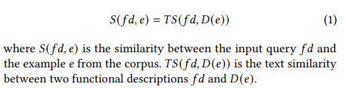

Similarity is calculated using cosine similarity on vectorized descriptions, utilizing BERT embeddings for state-of-the-art performance:
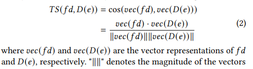

The number of examples is limited to ten to comply with prompt length constraints in large language models.[Source Code](https://github.com/contextcraft/contextcraft/blob/main/Source_Code/Embedding_Vector_DataBase.ipynb)
#  [ Probabilistic Token Positioning:]() 
## Overview

Predict token positions in method names based on their appearance in functional descriptions. [Source Code](https://github.com/contextcraft/contextcraft/blob/main/Source_Code/PTPandPWI.ipynb)

## Concept
Compute the likelihood of tokens from descriptions appearing in various positions within method names (prefix, infix, suffix).

## Process

### Decomposition
- Split functional descriptions by whitespace and punctuation.
- Split method names by camelCase and underscore conventions.

### Probability Calculation
- **Prefix Probability (𝑃prefix)**: Likelihood of token 𝑡 appearing as the first token in method names.
  ```math
  𝑃prefix(𝑡) = \frac{\text{Occurrences of 𝑡 as prefixes of names}}{\text{Occurrences of 𝑡 in descriptions}}
### Algorithm 1
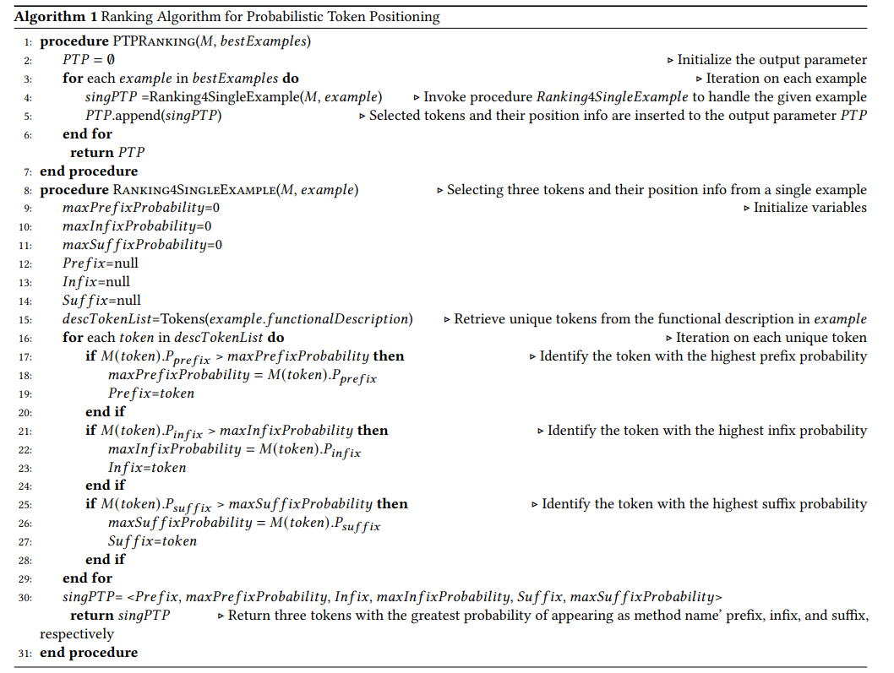
# [Pivot Word Identification](https://github.com/propaki/Automethod/tree/main/SFT-Training-Corpus):
## Overview
Pivot Word Identification (PWI) is a process designed to enhance the generation of method names from functional descriptions. While directly copying tokens from functional descriptions to method names is one approach, PWI identifies semantically similar words (pivot words) that can inform method name generation even if they aren't directly copied. These pivot words are added to the prompt to improve the relevance and accuracy of the generated method names.[Source Code](https://github.com/contextcraft/contextcraft/blob/main/Source_Code/PTPandPWI.ipynb)

## Steps in Pivot Word Identification

### 1. Initialization

- **Extract Tokens**: Extract tokens from both the functional description and the method name.
- **Setup**: Initialize an empty set to store identified pivot words.

### 2. Iterate Through Method Name Tokens

- **Compare Tokens**: For each token in the method name, identify tokens in the functional description that are semantically similar.
- **Compute Similarity**: Use cosine similarity of BERT embeddings to measure semantic similarity between tokens.
- **Identify Pivot Words**: If a token from the functional description has a similarity score above a predefined threshold and is the highest compared to others, mark it as a pivot word.

### 3. Record Pivot Words

- **Collect Data**: Record each identified pivot word along with the associated method name token and their similarity score.

### 4. Remove Duplicates

- **Ensure Uniqueness**: Ensure that the pivot words list contains unique entries by retaining only the instance with the greatest similarity score for each word.

### 5. Return Results

- **Output**: Return the final list of pivot words, including their corresponding method name tokens and similarity scores.

## Outcome

The PWI process results in a list of pivot words from the functional description that, while not directly part of the method name, are semantically related and useful for generating the method name. This technique enhances the precision and contextual relevance of method name generation in automated systems.

## Requirements

- **Natural Language Processing Tools**: Tokenizers and vector similarity measures.
- **BERT Embeddings**: To compute semantic similarity between tokens.


## Example Usage

Below is a conceptual outline for using PWI in your project. This is not a full code implementation but illustrates the high-level steps:

1. **Prepare Functional Descriptions and Method Names**: Extract tokens from your functional descriptions and corresponding method names.
2. **Compute Similarities**: Use BERT embeddings to compute cosine similarity between tokens.
3. **Identify and Record Pivot Words**: Determine pivot words based on similarity scores and store them.
4. **Remove Duplicates**: Ensure pivot words list is unique by removing duplicates.
5. **Utilize Pivot Words**: Use the identified pivot words to enhance your method name generation process.

## Algorithm 2
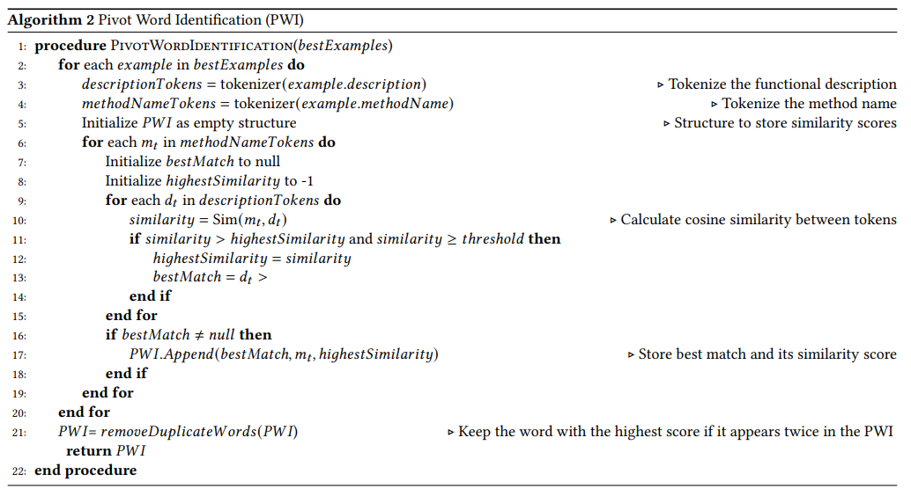
# [LLM-based Feedback Mechanism:]()
## Overview

The LLM-based Feedback Mechanism (LFM) evaluates the effectiveness of a Language Learning Model (LLM) in generating method names from functional descriptions. Unlike token-based processes, LFM provides quantitative feedback by comparing the generated method names with the ground truth names from examples. This feedback mechanism measures the accuracy of the LLM's output and highlights discrepancies to improve model performance.[Source Code](https://github.com/contextcraft/contextcraft/blob/main/Source_Code/LLM_FeedBack.ipynb)

## Steps in LLM-based Feedback Mechanism

### 1. Generate Method Name

- **Feed Prompt to LLM**: Input the functional description from each example into the LLM.
- **Generate Method Name**: Request the LLM to generate a method name based on the provided description.

### 2. Compare Generated Name with Ground Truth

- **Compute Edit Distance**: Compare the method name generated by the LLM with the actual method name in the example using character-based edit distance.
- **Assess Similarity**: Evaluate how closely the generated name matches the ground truth based on the edit distance score.

### 3. Generate Feedback Message

- **Specify Differences**: Create a feedback message (`msg`) detailing how the generated method name differs from the actual method name.
- **Highlight Discrepancies**: The message should include specific information about insertions, deletions, or substitutions needed to align the generated name with the ground truth.

## Outcome

The LFM process provides quantitative feedback on the LLM's method name generation. By comparing generated names with ground truth names and highlighting differences, it helps in identifying areas where the LLM's performance can be improved.

## Requirements

- **Language Learning Model (LLM)**: A model capable of generating method names from functional descriptions.
- **Edit Distance Calculation**: Tools or algorithms to compute the edit distance between two strings.

## References

- **Edit Distance**: [Edit Distance - Wikipedia](https://en.wikipedia.org/wiki/Edit_distance)

## Example Usage

Below is a conceptual outline for using LFM in your project:

1. **Prepare Data**: Collect functional descriptions and corresponding ground truth method names from your dataset.
2. **Generate Names**: Use the LLM to generate method names based on the functional descriptions.
3. **Compare Names**: Calculate the edit distance between each generated method name and the ground truth method name.
4. **Provide Feedback**: Create feedback messages that specify the differences and suggest corrections.
# Template-based Prompt Generation
With the outputs from the preceding sections, we have collected all the information to create a context-rich prompt [Source Code](https://github.com/contextcraft/contextcraft/blob/main/Source_Code/ContextCraft.ipynb). The prompt is composed of five parts:
1. **Best Examples**: Retrieved from the corpus
2. **Probabilistic Token Positioning (PTP)**: Tokens identified for potential copying
3. **Pivot Words**: Useful words identified from the functional descriptions
4. **LLM-based Feedback**: Quantitative feedback on LLM-generated method names
5. **Query**: Composed of predefined text (an order to the LLM) and the functional description.
### Example Prompt
Here’s how an example prompt is structured:
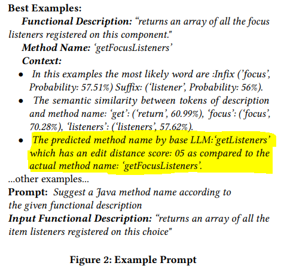
# Evaluation
##  Improving the State of the Art
We applied each of the evaluated approaches to the same dataset independently. The evaluation results are presented
in Table 2. The first column presents the evaluated approaches,
whereas columns 2-4 present the performance metrics.
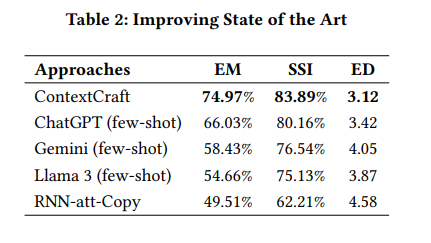
From Table 2 we can conclude that the proposed approach substantially improves the state of the art.
## Effect of Individual Components
We disabled one component at a time and repeated the evaluation. 
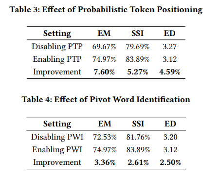
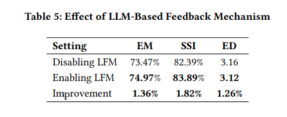
By comparing the results against those of the default setting (where all components were enabled), we may quantitatively
reveal the effect of the given component. Notably, the proposed approach is composed of three key components, i.e., probabilistic token positioning, pivot word identification, and LLM-based feedback mechanism. 
## Working with Various LLMs
We replaced the underling large language model (i.e., ChatGPT-4o) with other large language models, and re-evaluated the approach. The purpose of the evaluation is two fold. On one side, the evaluation would reveal whether the proposed approach remains effective when the underling LLM is related with other LLMs.
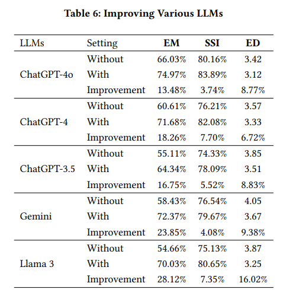
We conclude based on the preceding discussion that the proposed approach has good generalization ability and it works well with various LLMs.
## Working with Diffferent Length of functional description and Method 
The table lists the performance of five models—ChatGPT-3.5, ChatGPT-4, ChatGPT-4o, Gemini, and Llama3—across different lengths of functional descriptions, ranging from 0 to 5 tokens up to 40+ tokens.
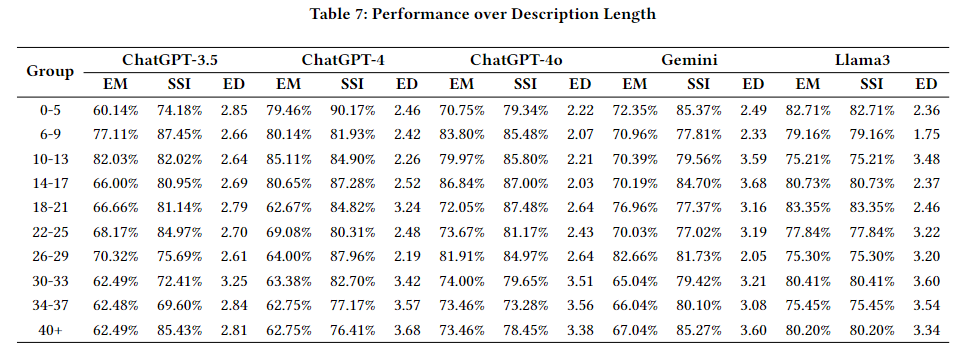
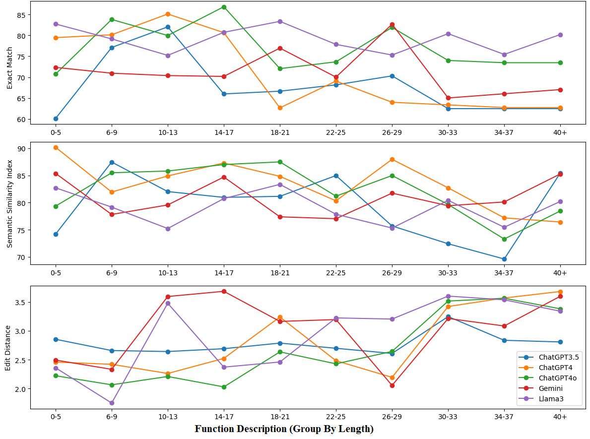
### Observations
1. ChatGPT-4 consistently performs well across shorter functional descriptions (0-13 tokens) with high exact match percentages and semantic similarity scores.
2. Gemini shows strong performance in longer functional descriptions (18+ tokens) with notable exact match rates and semantic similarity indexes.
3. Llama3 tends to have the lowest edit distances in several categories, indicating efficient generation with fewer modifications required.
4. ChatGPT-4o has competitive performance, especially in maintaining low edit distances, making it efficient in closer matches even when not leading in EM or SSI.
### Correlation Coefficient
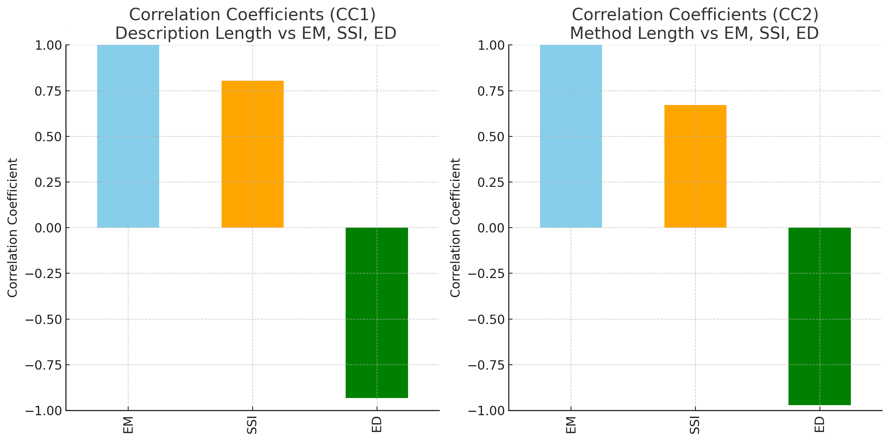
1. **CC1**: Description Length vs EM: Measures the correlation between Description Length and EM (Error Metric). Value: 1.000 (perfect positive correlation).
2. **CC2**: Description Length vs SSI: Measures the correlation between Description Length and SSI (System Similarity Index). Value: 0.805 (strong positive correlation).
3. **CC3**: Description Length vs ED: Measures the correlation between Description Length and ED (Error Detection). Value: -0.933 (strong negative correlation).
4. **CC4**: Method Length vs EM: Measures the correlation between Method Length and EM. Value: 1.000 (perfect positive correlation).
5. **CC5**: Method Length vs SSI: Measures the correlation between Method Length and SSI. Value: 0.673 (moderate positive correlation).
6. **CC6**: Method Length vs ED: Measures the correlation between Method Length and ED. Value: -0.971 (very strong negative correlation).
# ContextCraft

This snippet gives a clear, step-by-step guide for users to replicate the study, ensuring they understand how to set up their environment correctly. Make sure to include any additional specific instructions or prerequisites needed directly in your README or linked documentation to assist users further.
git clone https://github.com/contextcraft/contextcraft.git


