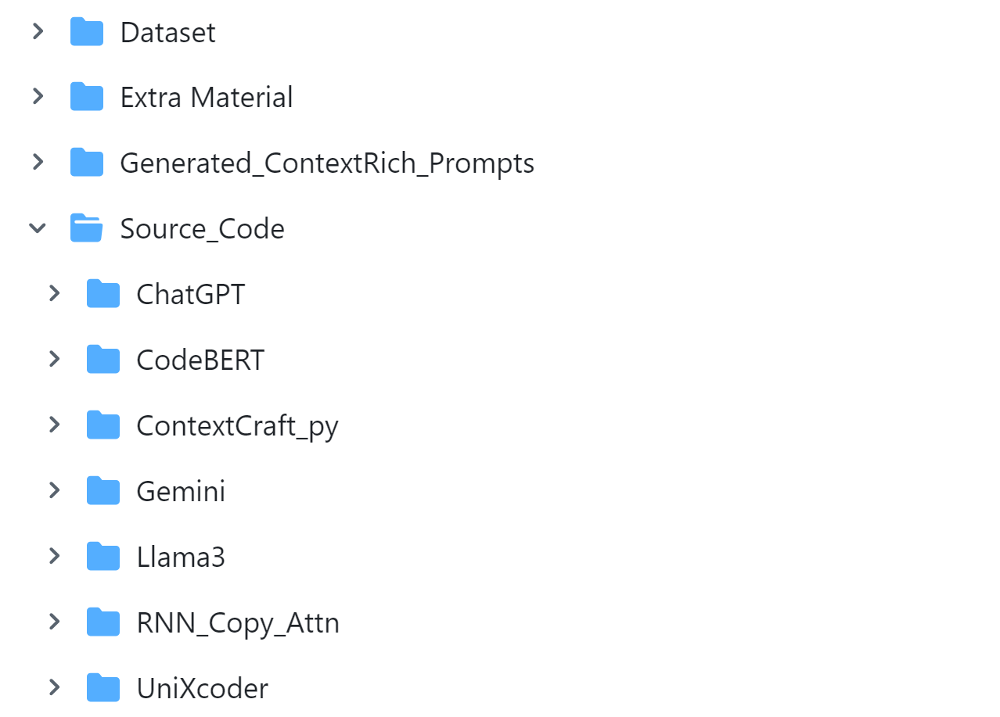

# Replication package for paper: "LLM-based Method Name Suggestion with Automatically Generated Context-Rich Prompts"

# ContextCraft:
ContextCraft is an automated algorithm to generating context-rich prompts for LLMs that generate the expected method names according to the prompts. For a given query (functional description), it retrieves a few best examples whose functional descriptions have
the greatest similarity with the query. From the examples, it identifies tokens that are likely to appear in the final method name as well as their likely positions, picks up pivot words that are semantically related to tokens in the according method names, and specifies
the evaluation results of the LLM on the selected examples. All such outputs (tokens with probabilities and position information, pivot words accompanied by associated name tokens and similarity scores, and evaluation results) together with the query and the selected examples are then filled in a predefined prompt template, resulting in a context-rich prompt.
## Directory Structure

This section provides an overview of the repository structure, including datasets, supplementary materials from the paper, source code for the evaluated models, and generated prompts to facilitate the reproduction of results.


### **Explanation of Key Classes and Methods:**

1. **BestExample**:
   - **Purpose**: This class is responsible for selecting the best functional descriptions from a CSV file based on semantic similarity to the input description.
   - **Key Methods**:
     - `find_top_n_similar_descriptions`: This method retrieves the top N similar descriptions from the CSV based on cosine similarity.

2. **ContextualInformationExtraction**:
   - **Purpose**: This class extracts contextual information (entities, actions, and context scope) from functional descriptions.
   - **Key Methods**:
     - `extract_entities`: Extracts entities (typically nouns).
     - `extract_actions`: Extracts actions (typically verbs).
     - `extract_context_scope`: Generates a context scope from the extracted entities and actions.

3. **PotentialNameEvaluation**:
   - **Purpose**: This class evaluates method names by calculating their edit distance and semantic similarity against the actual method name.
   - **Key Methods**:
     - `evaluate_method_names`: This method evaluates and ranks generated method names by computing their similarity to the actual method name.

4. **GenerativeInsightReasoning**:
   - **Purpose**: This class generates insights and reasoning behind each potential method name based on entities, actions, and context.
   - **Key Methods**:
     - `generate_reasoning_for_method`: Provides reasoning for a single method name.
     - `generate_all_insights`: Provides reasoning for all ranked method names.

5. **LangInsightCraft**:
   - **Purpose**: This class orchestrates all the steps involved in the process of generating method names. It combines the functionalities of all other classes to produce a context-enriched prompt for method name generation.
   - **Key Methods**:
     - `create_context_enriched_prompt`: This method creates the final context-enriched prompt for passing to the LLM for generating method names.

### **How It Works:**
1. **BestExample** class finds the most relevant examples from a CSV file based on semantic similarity to the input functional description.
2. **ContextualInformationExtraction** extracts the entities, actions, and context scope from these examples.
3. **PotentialNameEvaluation** evaluates and ranks the potential method names based on their edit distance and semantic similarity to the actual method name.
4. **GenerativeInsightReasoning** provides reasoning behind each ranked method name.
5. **LangInsightCraft** creates a context-enriched prompt using the outputs from all the classes and prepares it for use with a language model to generate method names.

---

This hierarchy ensures that each class has a specific role in the pipeline, and the workflow remains clean and modular. The **LangInsightCraft** class integrates the entire process, providing an easy-to-use interface for generating method names from functional descriptions.

## `Dataset`

This directory contains three datasets: Java, Python and Private datasets. Java and Python datasets contain three csv files (with two columns: Functional Description and Menthod Name) used for training, validation, and testing the models.

## Reproducing Results

To reproduce the results, the source code for the evaluated models is available. Click on each model to access its corresponding README file for implementation details:

- [ContextCraft](https://github.com/contextcraft/contextcraft/tree/main/Source_Code/ContextCraft_py)
- [RNN-Copy-Attn](https://github.com/contextcraft/contextcraft/blob/main/Source_Code/RNN_Copy_Attn/RNN_README.md)
- [CodeBERT](https://github.com/contextcraft/contextcraft/blob/main/Source_Code/CodeBERT/CodeBERT_README.md)
- [UniXcoder](https://github.com/contextcraft/contextcraft/blob/main/Source_Code/UniXcoder/UniXcoder_README.md)
- [ChatGPT](https://github.com/contextcraft/contextcraft/blob/main/Source_Code/ChatGPT/ChatGPT_README.md)
- [Gemini](https://github.com/contextcraft/contextcraft/blob/main/Source_Code/Gemini/Gemini_README.md)
- [Llama](https://github.com/contextcraft/contextcraft/blob/main/Source_Code/Llama3/Llama3_README.md)

For ease of reproduction, the generated prompts, along with the discussed settings (Section: 3.6 RQ3: Effect of Individual Components and 3.7 RQ4: Working with Various LLMs) , are provided in the "Generated Context-Rich Prompts" folder. These prompts include:

1. `java_test_Context_Rich_Prompt.csv`:
2. `java_test_FewShot_Prompt.csv`
3. `java_test_Context_Rich_Without_PTP_Prompt.csv`
4. `java_test_Context_Rich_Without_PWI_Prompt.csv`
5. `java_test_Context_Rich_Without_LFM_Prompt.csv`
6. `python_test_Context_Rich_Prompt.csv`
7. `python_test_FewShot_Prompt.csv`
8. `python_test_Context_Rich_Without_PTP_Prompt.csv`
9. `python_test_Context_Rich_Without_PWI_Prompt.csv`
10. `python_test_Context_Rich_Without_LFM_Prompt.csv`


## `ContextCraft Algorithm Implementation`
The source code of ContextCraft is organized into Classes with .py extention, as shown in following class hiarachy diagram:
### Class Hierarchy

### ContextCraft

**Purpose:** Orchestrates the use of ProbabilisticTokenPositioning, PivotWordIdentification, LLMBasedFeedback, and BestExample to analyze functional descriptions and method names from a CSV file. Generates formatted example descriptions and finds top similar examples based on semantic similarity.

#### Methods:

- `__init__(csv_file_path, api_client)`: Initializes ContextCraft with the path to the CSV file and the LLM API client. Creates instances of the other classes and reads the CSV into a DataFrame.
- `process_csv_file()`: Processes the CSV file by:
  - Calculating prefix, infix, and suffix probabilities.
  - Identifying pivot words using semantic similarity.
  - Generating feedback using LLM predictions.
  - Formatting and saving the processed descriptions.
- `get_token_positions(tokens)`: Determines the most likely prefix, infix, and suffix for a given set of tokens based on their probabilities.
- `format_pivot_words(pivot_words)`: Formats the pivot words into a readable string.
- `format_example_description(func_desc, method_name, prefix, infix, suffix, pivot_words, feedback)`: Formats the example description to include functional description, method name, context, and feedback.
- `find_similar_examples(input_description)`: Uses BestExample to find the top 10 similar functional descriptions. Processes and formats these descriptions similarly to `process_csv_file()`.

### ProbabilisticTokenPositioning

**Purpose:** Calculates position probabilities for tokens and provides methods for extracting and lemmatizing tokens. Creates a DataFrame of these probabilities for further analysis.

#### Methods:

- `__init__()`: Initializes the lemmatizer, inflect engine, and data structures for counting token positions and occurrences.
- `get_wordnet_pos(word)`: Maps POS tags to the format accepted by the lemmatizer.
- `extract_tokens(text)`: Extracts and lemmatizes tokens from the input text.
- `calculate_position_probabilities(df)`: Calculates the probabilities of tokens appearing as prefix, infix, or suffix in method names.
- `create_probability_df(position_probabilities)`: Converts the position probabilities into a DataFrame for easy access and manipulation.

### PivotWordIdentification

**Purpose:** Uses embedding model to find the best matching description token for method name tokens based on semantic similarity. Generates embeddings for comparison.

#### Methods:

- `__init__()`: Initializes the text-embedding-ada-003 model.
- `get_token_embeddings(text)`: Generates  embeddings for each token in the input text.
- `find_best_description_tokens(method_name, description)`: Finds the best matching description token for each method name token by comparing embeddings using cosine similarity.

### LLMBasedFeedback

**Purpose:** Predicts method names using an LLM API and compares them with actual method names using the edit distance formula. Generates feedback statements based on this comparison.

#### Methods:

- `__init__(api_client)`: Initializes LLMBasedFeedback with the LLM API client (ChatGPT-4o).
- `predict_method_name(functional_description)`: Uses the LLM API to predict method names from functional descriptions.
- `compare_with_actual(predicted_name, actual_name)`: Compares predicted method names with actual names using edit distance to determine similarity.
- `generate_feedback(predicted_name, actual_name)`: Generates a feedback statement comparing the predicted and actual method names, including the edit distance score.

### BestExample

**Purpose:** Finds the top 10 semantically similar functional descriptions from a CSV file by comparing each description to a given input description using discussed models (Section 3.5 RQ2: Impact of Embedding Models on Performance).

#### Methods:

- `__init__(csv_file_path)`: Initializes BestExample with the path to the CSV file and reads it into a DataFrame.
- `get_sentence_embedding(text)`: Generates a sentence-level embedding for the input text using embedding model.
- `find_top_n_similar_descriptions(input_description, n=10)`: Finds the top n semantically similar functional descriptions by computing the cosine similarity between the input description and descriptions in the CSV file. Returns the most similar descriptions with their method names.

### Implementation Workflow

#### Initialization:

1. ContextCraft initializes instances of ProbabilisticTokenPositioning, PivotWordIdentification, LLMBasedFeedback, and BestExample.
2. Reads the CSV file into a DataFrame for processing.

#### CSV File Processing:

1. ContextCraft uses ProbabilisticTokenPositioning to calculate probabilities for prefix, infix, and suffix.
2. Uses PivotWordIdentification to find semantic pivot words based on text-embedding-ada-003 embeddings.
3. Uses LLMBasedFeedback to predict method names and generate feedback.
4. Formats and saves processed data with examples.

#### Finding Similar Examples:

1. ContextCraft uses BestExample to find top 10 similar functional descriptions for a given input.
2. Processes these descriptions similarly and formats them with context and feedback.

This hierarchy and description provide a detailed overview of the roles and responsibilities of each class, their methods, and how they interact within the ContextCraft framework to process and analyze functional descriptions and method names.


!pip install -r requirements.txt

This snippet gives a clear, step-by-step guide for users to replicate the study, ensuring they understand how to set up their environment correctly. Make sure to include any additional specific instructions or prerequisites needed directly in your README or linked documentation to assist users further.
git clone https://github.com/contextcraft/contextcraft.git
```markdown
## **Usage Example**

Here's an example of using ContextCraft:

```python
from contextcraft import ContextCraft

# Initialize with the path to CSV and LLM API client
context_craft = ContextCraft('data/functional_descriptions.csv', api_client)

# Process the CSV file
context_craft.process_csv_file()

# Find similar examples along with prefixes, infixes,suffixes, pivot words and LLM-based suggestions for a given description
context_rich_prompt = context_craft.find_similar_examples('example functional description')

# Output the similar examples
print(context_rich_prompt)


